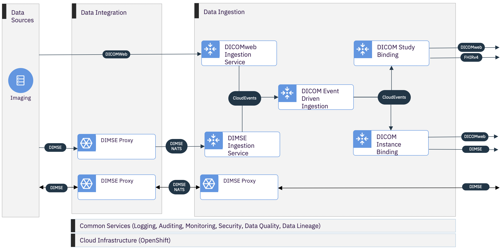

# Alvearie Imaging Ingestion
  The Imaging Ingestion component brings a number of capabilities to the Alvearie ecosystem.  It provides all of the necessary capability to extend the reach of existing enterprise medical Imaging systems to a modern hybrid cloud.  This component leverages a number of *Cloud Native Computing Foundation* (CNCF) projects to cloud-enable standards-based medical imaging application interfaces such as DICOM Message Service Element (DIMSE) and DICOMweb.  Being composed of a number of flexible subcomponents, it is possible to extend enterprise imaging systems to the cloud with custom, fit for purpose deployments.  This is possible at speed, low cost, and little or zero integration effort.  
  
Some potential usages:

  - Perform lightweight secure bridging of DICOM from the enterprise imaging zone to a cloud availability zone.
  - Utilize cloud-based, fine-grained, secure storage spaces for segregating DICOM data to be used for clinical or scientific purposes.
  - Distribute DICOM data to a number of different medical imaging subscribers
  - Generate FHIRv4 *ImagingStudy* resources from ingested content and publish to a FHIRv4 based patient logitudinal record.
  - Distribute imaging study arrival and update notifications to imaging study subscribers

## Imaging Ingestion Approach
  Medical Imaging clinical workflow is inherently event-driven, and solutions must be real-time.  Starting with image acquisition, DICOM instances are elements of an ordered sequence of images captured by an imaging modality.  Collectively, this sequence makes up an imaging modality series.  There may be many imaging modality series, from any number of imaging modalities, within an imaging study.    Conceptually, each DICOM instance is not unlike an observation from an IoT device.  Each DICOM instance is an atomic observation (fact) that collectively constitute an imaging study (behavior).  

The design approach of the imaging ingestion component is to allow for the real-time ingestion and distribution of DICOM instances (facts) to a set of instance subscribers.  It aggregates DICOM instances into revisions of DICOM studies (behaviors) that are distributed to study subscribers.  In these regards, it supports a number of imaging standards including DICOMweb, DIMSE, and FHIRv4.  Additionally, a DIMSE (OSI level 4) proxy is provided for both unidirectional and bidirectional (OSI level 7) secure communication between the cloud and enterprise imaging systems.  The proxy uses [NATS](https://nats.io) as the messaging protocol.

From a technology and architecture perspective, the approach is to deliver a number of small subcomponents that interact with one another in a request-response pattern at the edges, and an event-first pattern in the core.  Every subcomponent is designed and developed to be small, fast, and portable.  Each subcomponent is written in either [Golang](https://golang.org) or [Java](https://www.java.com) with all of the Java authored components using [Quarkus](https://quarkus.io) to natively optimize runtime behavior.  Each subcomponent is exposed as a *Kubernetes Custom Resource Definition (CRD)* for a cloud-native operating model.  A *Kubernetes Operator* is provided to both manage the *Custom Resource (CR)*  objects, as well as configure the event-driven and messaging frameworks that the subcomponents participate within.  The operator provides support for the [Knative Serving and Eventing](https://knative.dev) event-driven framework.

Underlying support for DICOM standards is consumed from the [dcm4che](https://www.dcm4che.org) project.  The imaging ingestion subcomponents wrap and extend these capabilities to provide Quarkus runtime components that are operated in a cloud-native model.

Our initial goal is to provide enough capability to deliver a rapid proof-of-value. Alvearie Imaging ingestion is designed for **flexible deployment** options and implemented to **run small, run fast, and run anywhere**.

## Component Architecture

The imaging ingestion component is currently comprised of six (6) subcomponents:
  
  1. [DIMSE Proxy](docs/dimse-proxy/overview.md) enables a DIMSE Application Entity (AE) point-of-presence in the enterprise imaging zone and/or within the *Kubernetes* cluster.  
  2. [DIMSE Ingestion Service](docs/dimse-ingestion-service/overview.md) provides a proxied DIMSE Application Entity (AE) in the *Kubernetes* cluster for C-STORE and C-FIND operations on a storage space.
  3. [DICOMweb Ingestion Service](docs/dicomweb-ingestion-service/overview.md) for DICOMweb QIDO-RS, WADO-RS, and STOW-RS access to a storage space.
  4. [DICOM Event Driven Ingestion](docs/event-driven-ingestion/overview.md) maintains a manifest of all DICOM data across all ingestion storage spaces.
  5. [DICOM Instance Binding](docs/dicom-instance-binding/overview.md) for fan-out notification of DICOM instance data.
  6. [DICOM Study Binding](docs/dicom-study-binding/overview.md) for fan-out notification of DICOM studies.
  
 The *DICOM Instance Binding* and *DICOM Study Binding* components are intended to enable consistent deployment and management of a number of different implementations.  Implementations may range from DICOMweb, to FHIRv4, to DIMSE, to proprietary.  Our development [roadmap](docs/roadmap.md) provides details on planned support for all medical imaging standard protocols.

## Development Roadmap
  Development Roadmap is available [here](docs/roadmap.md).  Community feedback is welcome! 
  
  - Getting started with [contribution](CONTRIBUTING.md), including how to build from source.
  - Open an [issue](https://github.com/Alvearie/imaging-ingestion/issues).

## Deployment Dependencies
  The preferred deployment has the following deployment dependencies beyond *Kubernetes* core.  There a number of ways in which these dependencies can be added to the cluster; depending upon the target platform.  The preferred approach is to use *Kubernetes* operators whenever possible. 

  
| Dependency               | Function  |  Open Source Operator          | Openshift |  OpenSource Available in OperatorHub.io | Deployment Example  |
|--------------------------|-----------|------------------------------|-----------------------------|----------------------|---------------------------------------------|
|[Certificate Manager](https://cert-manager.io)| Certificate Management  | [cert-manager](https://github.com/jetstack/cert-manager) | certified | yes | |
| [Istio](https://istio.io)| Service mesh for Knative and service security overlay| [Istio Operator](https://github.com/istio/istio/tree/master/operator) |OpenShift Service Mesh |  yes | |
|[Knative Serving and Eventing](https://knative.dev/docs/serving)| Serving elastic scalable microservices and Event-first interaction patterns between microservices | [Knative Operator](https://github.com/knative/operator) | OpenShift Serverless Operator | yes | | 
|[PostgreSQL](https://www.postgresql.org)| Default backing store for imaging manifest data | [Crunchy Data PostgreSQL Operator ](https://github.com/CrunchyData/postgres-operator) | certified | yes | |
|Any S3 compliant object storage| DICOM storage spaces| [MinIO](https://github.com/minio/minio-operator) | OpenShift Container Storage |  yes |  |
|[NATS](https://nats.io)| Messaging DIMSE to/from the enterprise imaging security zone and *Kubernetes*.  **This is optional and only needed for DIMSE support**.| [NATS Operator](https://github.com/nats-io/nats-operator) |Not certified |  no | [example](examples/nats/README.md) |

## Installation and Deployment
  The preferred deployment model for image ingestion is to use the provided [Alvearie Imaging Ingestion Operator](imaging-ingestion-operator) for installation and management of the subcomponents that are hosted within the *Kubernetes* cluster.  The operator extends the *Kubernetes* API to provide a *Custom Resource Definition* for each of the imaging ingestion subcomponents.  The documentation page of each component provide details and examples for the *Custom Resources*, *Secret*, and *ConfigMap* objects. 

**Installation and Deployment on Kubernetes procedure:**
  1. Install the [Alvearie Imaging Ingestion Operator](imaging-ingestion-operator) 
  2. Create a database for the imaging manifest data
  3. Declare a [DICOM Event Driven Ingestion](docs/event-driven-ingestion/overview.md), configuring it to use the provided  database
  4. Create a S3 Object bucket for each storage space needed
  5. Declare a [DICOMweb Ingestion Service](docs/dicomweb-ingestion-service/overview.md) for each storage space
  6. Declare [DICOM Instance Binding](docs/dicom-instance-binding/overview.md) and [DICOM Study Binding](docs/dicom-study-binding/overview.md) as needed for distribution of DICOM instances and DICOM study notifications.

**Enabling DIMSE ingestion from the enterprise imaging zone to the storage space created in step 4 above**
  In order to ingest DIMSE from the enterprise imaging zone to a imaging ingestion storage space, a proxy will need to be deployed within the enterprise imaging zone.  This proxy will be used to project the DIMSE Ingestion Service into the zone.  The proxy will use NATS to forward the C-STORE operations to the DIMSE Ingestion Service. 

  1. Configure a NATS for a secure subject for the two subcomponents to communicate.
  2. Declare a [DIMSE Ingestion Service](docs/dimse-ingestion-service/overview.md) in *Kubernetes* providing references to the NATS service and subject.  If the subject is secured using NATS accounts, the JWT tokens for accessing subject will also be need to be provided as a *Secret*.
  3. Install a [DIMSE Proxy](docs/dimse-proxy/overview.md) in the enterprise imaging zone.
  4. Configure the DIMSE Proxy to use the NATS subject and tokens created by the operator in step 1.

  

