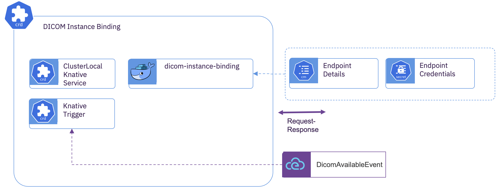

# DICOM Instance Binding 

## Overview
  The *DICOM Instance Binding* subcomponent subscribes to DICOM instances that have been completely ingested.  A *DICOM Instance Binding* is both optional and can have any cardinality. Each instance is independently notified of ingested DICOM instances through the *DicomAvailableEvent*.  There can be any number of potential implementations of the binding.  

## Subcomponent Architecture



The *DICOM Instance Binding* has a single container that is invoked by the event broker on every *DicomAvailableEvent*.  

## Provided Bindings
  There is currently only one provided binding container.  The provided container retrieves the subject of the *DicomAvailableEvent* using the cluster local address of the WADO-RS reference to the resource and pushes that resource to a downstream consumer using STOW-RS.
  
## Deployment


**Target Service Endpoint Details**

Create a *ConfigMap* with the service address for DICOM delivery.  Depending upon the binding type, this may have a different data.  This example is valid for the provided STOW-RS binding.

```yaml
kind: ConfigMap
apiVersion: v1
metadata:
  name: instance-binding-config
data:
  STOW_ENDPOINT: 'https://dcm4chee.0a0527d6.nip.io/dcm4chee-arc/aets/DCM4CHEE/rs/studies'
```

**Target Service Security Details**

Create a *Secret* with the credentials for the target service.  Depending upon the security posture, this may have a different data.

```yaml
kind: Secret
apiVersion: v1
metadata:
  name: instance-binding-secret
type: Opaque
```

**Custom Resource**

Create the subcomponent deployment

```yaml
apiVersion: imaging-ingestion.alvearie.org/v1alpha1
kind: DicomInstanceBinding
metadata:
  name: stow
spec:
  # Reference to the target service endpoint details
  bindingConfigName: instance-binding-config
  # Reference to the target service security credentials
  bindingSecretName: instance-binding-secret
  # Reference to the event broker to process DicomAvailable events
  dicomEventDrivenIngestionName: core
  # Scaling behavior of the binding
  instanceBinding:
    concurrency: 0
    maxReplicas: 3
    minReplicas: 0
 ```