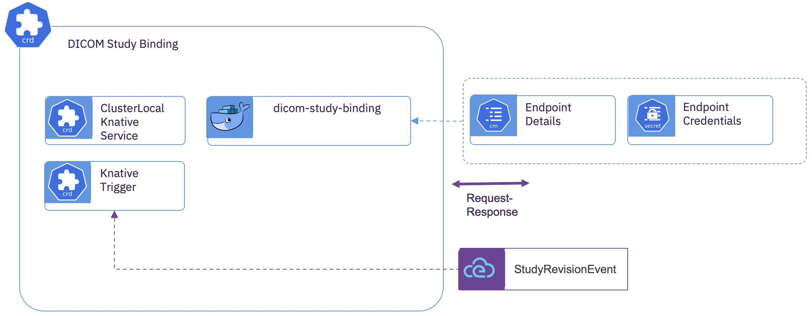

# DICOM Study Binding 

## Description

The *DICOM Study Binding* subcomponent subscribes to ingested DICOM study revisions.  A *DICOM Study Binding* is both optional and can have any cardinality.  Each instance has the ability to notify downstream services of the existence of an ingested study and it's revision updates.

## Subcomponent Architecture



The *DICOM Study Binding* has a single container that is invoked by the event broker on every *StudyRevisionEvent*.  

## Provided Bindings
  There is currently only one provided binding container.  The provided container transforms the data within the *StudyRevisionEvent* into a FHIRv4 *ImagingStudy* resource with the FHIRv4 *EndpointReference* for the study data being the external WADO-RS for the storage space containing the study data. It pushes the generated resource to a configured downstream FHIRv4 consumer.
  
## Deployment

**Target Service Endpoint Details**

Create a *ConfigMap* with the service address for DICOM delivery.  Depending upon the binding type, this may have a different data.  This example is valid for the provided FHIRv4 binding.

```yaml
kind: ConfigMap
apiVersion: v1
metadata:
  name: study-binding-config
data:
  FHIR_ENDPOINT: 'https://fhir-server.0a0527d6.nip.io/fhir-server/api/v4/ImagingStudy'
```

**Target Service Security Details**

Create a *Secret* with the credentials for the target service.  Depending upon the security posture, this may have a different data.

```yaml
kind: Secret
apiVersion: v1
metadata:
  name: study-binding-secret
data:
  FHIR_AUTH_PASSWORD: xxxxxxx=
  FHIR_AUTH_USERNAME: yyyyyy=
type: Opaque
```

**Custom Resource**

Create the subcomponent deployment

```yaml
apiVersion: imaging-ingestion.alvearie.org/v1alpha1
kind: DicomStudyBinding
metadata:
  name: fhir
spec:
  # Reference to the target service endpoint details
  bindingConfigName: study-binding-config
  # Reference to the target service security credentials
  bindingSecretName: study-binding-secret
  # Reference to the event broker to process DicomStudyRevision events
  dicomEventDrivenIngestionName: core
  # Scaling behavior of the binding
  studyBinding:
    concurrency: 0
    maxReplicas: 3
    minReplicas: 0
```