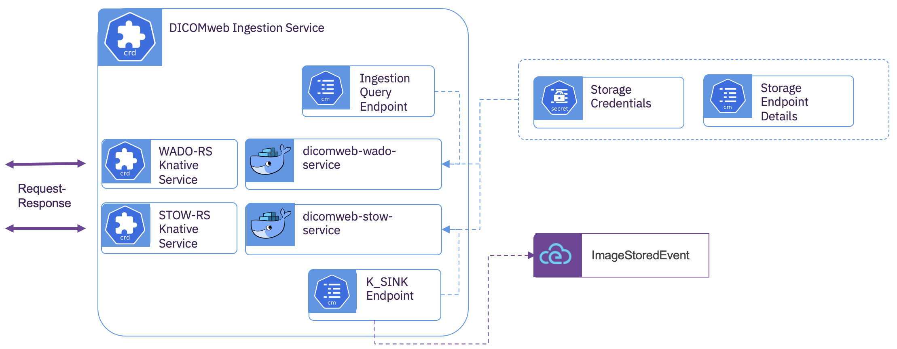

# DICOMweb Ingestion Service

## Overview
  DICOMweb is the DICOM Standard for web-based medical imaging.  The *DICOMweb Ingestion Service* resides within *Kubernetes* and provides RESTful services for DICOM storage (STOW-RS), DICOM search (QIDO-RS), and DICOM retrieve (WADO-RS) from a storage space.  This subcomponent is mandatory for each storage space as all stored DICOM, regardless of storage service (DICOMweb or DIMSE), are retrieved by downstream subcomponents using the provided WADO-RS.

## Subcomponent Architecture


The *DICOMWeb Ingestion Service* provides two containers that are bound to a common storage space.  The *dicomweb-stow-service* provides the ability to write DICOM to a storage space using STOW-RS.   The *dicomweb-wado-service* provides the ability to search DICOM within a storage space using QIDO-RS and retrieve DICOM from a storage space using WADO-RS. 

**dicomweb-stow-service**

Provides the STOW-RS implementation.  When the STOW-RS service is pushed DICOM objects for storage, the service first stores the data in the bound storage space.  It then parses the DICOM group and attribute information while stripping the data.  The group and attribute data is wrapped into a *ImageStoredEvent* along with a pointer to where the raw data was stored as WADO-RS references.  The resulting *ImageStoredEvent* is sent to the configured event broker for downstream processing.

**dicomweb-wado-service**

Provides the QIDO-RS and WADO-RS implementations.  When DICOM is stored in the storage space, the *DICOMweb Ingestion Service* has no record of where that data is placed or it's DICOM study context.  The *Ingestion Query Endpoint* provides the binding to the 
*DICOM Event Driven Ingestion* for searching for raw DICOM resources within the storage space.   

## Deployment  
  The *DICOMweb Ingestion Service* is intended to be consumed within a *Kubernetes* cluster with *Knative Serving* and *Knative Eventing*.  The provided [operator](../operator/overview.md) provides a single *Custom Resource Definition* for creating and managing instances of the *DICOMweb Ingestion Service* subcomponent.  The provided operator will deploy the *DICOMweb Ingestion Service* as two *Knative* service configurations with an ingress to each service.  There are also Cluster Local addresses provided for accessing the services from within the local *Kubernetes* cluster.  The provided *Custom Resource* exposes the elastic behavior of the services with the ability to specify concurrency and both upper and lower replica counts for scaling.  The operator performs all of the wiring of the *KSINK Endpoint* to the event broker and the *Ingestion Query Endpoint* to the *DICOM Event Driven Ingestion Service*.


**S3 Bucket Endpoint Details**

Create a *ConfigMap* with the S3 service address and the object bucket to use.

```yaml
kind: ConfigMap
apiVersion: v1
metadata:
  name: img-ingest-s3
data:
  BUCKET_HOST: s3-service.s3-namespace.svc.cluster.local
  BUCKET_NAME: img-hri-6127b169-b7ae-429d-b74b-d58e7fcfdd58
  BUCKET_PORT: '80'
  BUCKET_REGION: region1
  BUCKET_SUBREGION: ''

```

**S3 Bucket Credentials**

Create a *Opague Secret* with the API key and access token for accessing the provided object bucket.

```yaml
kind: Secret
apiVersion: v1
metadata:
  name: img-ingest-s3
data:
  AWS_ACCESS_KEY_ID: xxxxxx=
  AWS_SECRET_ACCESS_KEY: yyyyyyyyy==
type: Opaque
```

 
 **Custom Resource**

Create the subcomponent deployment

```yaml
apiVersion: imaging-ingestion.alvearie.org/v1alpha1
kind: DicomwebIngestionService
metadata:
  name: img-ingest
spec:
  # Reference to the ConfigMap with the S3 endpoint details
  bucketConfigName: img-ingest-s3
  # Reference to the Secret with the S3 credentials
  bucketSecretName: img-ingest-s3
  # Reference to the event broker that was created with the DicomEventDrivenIngestion custom resource
  dicomEventDrivenIngestionName: core
  # The name of this provider, for grouping many subcomponents together.
  providerName: provider
  # Scaling behavior of the STOW-RS 
  stowService:
    concurrency: 0
    maxReplicas: 3
    minReplicas: 0
  # Scaling behavior of the WADO-RS 
  wadoService:
    concurrency: 0
    maxReplicas: 3
    minReplicas: 0
```


## Usage

The operator will create knative services for each of the STOW-RS, and QIDO-RS/WADO-RS.  These service URLs will have the following naming pattern.

|Service       | Naming Pattern                                    | Example         |
|--------------|:--------------------------------------------------|:----------------|
|STOW-RS       | https://&lt;custom-resource-name&gt;-stow.&lt;namespace&gt;.&lt;domain&gt;/stow-rs | `https://img-ingest-stow.imaging-ingestion.mycluster.net/stow-rs` |
|WADO-RS/QIDO-RS       | https://&lt;custom-resource-name&gt;-wado.&lt;namespace&gt;.&lt;domain&gt;/wado-rs | `https://img-ingest-stow.imaging-ingestion.mycluster.net/wado-rs` |

