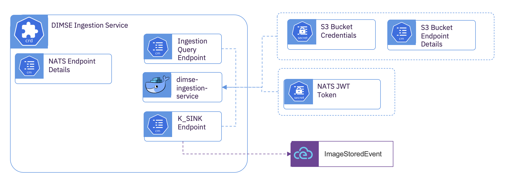

# DICOM Message Service Element (DIMSE) Ingestion Service 

## Overview
  The *DIMSE Ingestion Service* is an optional sub-component of the *Kubernetes* deployment.  This subcomponent provides the ability to C-STORE DICOM using the *DIMSE Proxy*. The *DIMSE Proxy* and *DIMSE Ingestion Service* sub-components are deployed as pairs, the proxy within the enterprise imaging zone, and the ingestion service within *Kubernetes*.  A separate deployment of this subcomponent is required for each storage space.  When creating a storage space with *DIMSE Ingestion Service*, a *DICOMweb Ingestion Service* needs to also be provided for the storage space.  This allows downstream sub-components to retrieve data using WADO-RS.

## Subcomponent Architecture


The *DIMSE Ingestion Service* provides a single container that is bound to both a storage area and a NATS subject for communication.  

## Deployment

**S3 Bucket Endpoint Details**

Create a *ConfigMap* with the S3 service address and the object bucket to use.

```yaml
kind: ConfigMap
apiVersion: v1
metadata:
  name: img-ingest-s3
data:
  BUCKET_HOST: s3-service.s3-namespace.svc.cluster.local
  BUCKET_NAME: img-hri-6127b169-b7ae-429d-b74b-d58e7fcfdd58
  BUCKET_PORT: '80'
  BUCKET_REGION: region1
  BUCKET_SUBREGION: ''

```

**S3 Bucket Credentials**

Create a *Opague Secret* with the API key and access token for accessing the provided object bucket.

```yaml
kind: Secret
apiVersion: v1
metadata:
  name: img-ingest-s3
data:
  AWS_ACCESS_KEY_ID: xxxxxx=
  AWS_SECRET_ACCESS_KEY: yyyyyyyyy==
type: Opaque
```

**Custom Resource**
  
Create the subcomponent deployment

```yaml
apiVersion: imaging-ingestion.alvearie.org/v1alpha1
kind: DimseIngestionService
metadata:
  name: img-ingest
spec:
  # Reference to the ConfigMap with the S3 endpoint details
  bucketConfigName: img-ingest-s3
  # Reference to the Secret with the S3 credentials
  bucketSecretName: img-ingest-s3
  # Reference to the event broker that was created with the DicomEventDrivenIngestion custom resource
  dicomEventDrivenIngestionName: core
  # The name of this provider, for grouping many subcomponents together.
  providerName: provider
  # The DIMSET AET the linked proxy is acting as
  applicationEntityTitle: "DICOM-INGEST"
  # The NATS service address
  natsUrl: 0a0527d6.nip.io:443
  # Enable TLS for NATS
  natsSecure: true
  # The ServiceAccount token that will be used to manage access to this NATS service
  # Future:  Not yet implemented
  #natsTokenSecret: nats-dicom-ingest-token-lhllv
```

