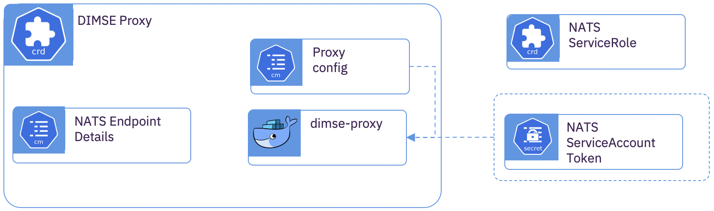

# DICOM Message Service Element (DIMSE) Proxy

## Overview

The DIMSE Proxy has many potential uses.  The proxy can be placed within the enterprise imaging zone not only as an ingestion proxy, but also as a fully functional DIMSE proxy with all of the composite (C-*) and normative (N-*) DIMSE services.  It inherits support DICOM Presentation Context and DICOM Transfer Syntaxes from [dcm4che](https://www.dcm4che.org).  Communication through the DIMSE proxy is performed over a dedicated secure [NATS](https://nats.io) subject.  This, in effect, allows the DIMSE OSI level 4 traffic to be raised to OSI level 7 with resilient communications to a muti-zone cloud deployment.

In the enterprise imaging zone, the DIMSE Proxy can be deployed as a standalone application, a docker container, or a Kubernetes Custom Resource (CR).

The DIMSE Proxy also has use-cases where it may be helpful to deploy within cloud.  By pairing a DIMSE proxy in the cloud with a DIMSE Proxy in the enterprise imaging zone, bidirectional communications can occur.  Example use cases may be:


-	Storing cloud AI insights back into the enterprise PACS. (C-STORE)
-	Driving an ingestion feedback loop of relevant study priors from the enterprise PACS. (C-FIND, C-MOVE)
-	Performing selective cohort study selection from the PACS to a cloud storage space, perhaps to perform further downstream de-identification and AI algorithm development. (C-FIND, C-MOVE)

# Subcomponent Architecture



## Deployment in the *Kubernetes* Cluster.

```yaml
apiVersion: imaging-ingestion.alvearie.org/v1alpha1
kind: DimseProxy
metadata:
  name: archive-proxy
spec:
  # The DIMSE AET the proxy is acting as
  applicationEntityTitle: "DICOM-INGEST"
  # Host of the DIMSE service in the clister this is acting as a proxy for
  targetDimseHost: dcm4che.dcm4che.svc.cluster.local
  # The port of the DIMSE service in the cluster
  targetDimsePort: 31285
  # The NATS service address
  natsUrl: 0a0527d6.nip.io:443
  # Enable TLS for NATS
  natsSecure: true
  # The root name of NATS subject where the proxy is subscribing and publishing messages
  natsSubjectRoot: DIMSE
  # The ServiceAccount token that will be used to manage access to this NATS service
  # Future:  Not yet implemented
  #natsTokenSecret: nats-dicom-ingest-token-lhllv
  proxy: {}
 ```

## Deployment as a Docker Container within the Enterprise Imaging Zone

`Coming Soon!`

## Deployment as an Application within the Enterprise Imaging Zone

`Coming Soon!`
