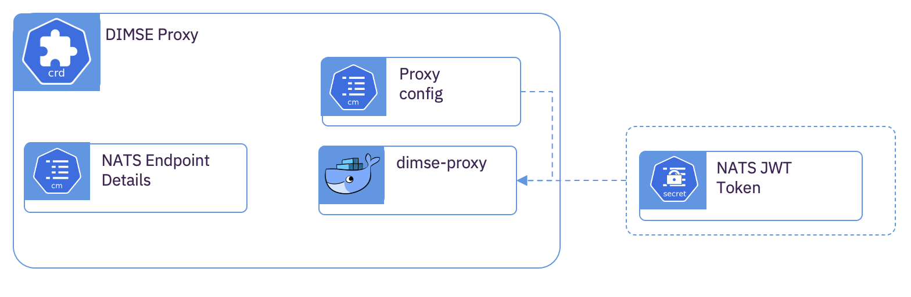

# DICOM Message Service Element (DIMSE) Proxy

## Overview

The DIMSE Proxy has many potential uses.  The proxy can be placed within the enterprise imaging zone not only as an ingestion proxy, but also as a fully functional DIMSE proxy with all of the composite (C-*) and normative (N-*) DIMSE services.  It inherits support for DICOM Presentation Context and DICOM Transfer Syntaxes from [dcm4che](https://www.dcm4che.org).  Communication through the DIMSE proxy is performed over a dedicated secure [NATS](https://nats.io) subject.  This, in effect, allows the DIMSE OSI level 4 traffic to be raised to OSI level 7 with resilient communications to a muti-zone cloud deployment.

Conceptually, the DIMSE Proxy is a means of remotely projecting a DIMSE Application Entity Type (AET) from the cloud to the enterprise imaging zone or from the enterprise imaging zone to the cloud.  Local AETs can perform DICOM SCU operations on the local proxy which acts as a stand-in for the DICOM SCP.  All of the operations are proxied over NATS to the remote proxy and subsequently forwarded to the actual DICOM SCP.

In the enterprise imaging zone, the DIMSE Proxy can be deployed as a standalone application, a docker container, or a Kubernetes Custom Resource (CR).

The DIMSE Proxy also has use-cases where it may be helpful to deploy within cloud.  By pairing a DIMSE proxy in the cloud with a DIMSE Proxy in the enterprise imaging zone, bidirectional communications can occur.  Example use cases may be:


-	Storing cloud AI insights back into the enterprise PACS. (C-STORE)
-	Driving an ingestion feedback loop of relevant study priors from the enterprise PACS. (C-FIND, C-MOVE)
-	Performing selective cohort study selection from the PACS to a cloud storage space, perhaps to perform further downstream de-identification and AI algorithm development. (C-FIND, C-MOVE)

# Subcomponent Architecture



## Deployment in the *Kubernetes* Cluster.
  
**NATS Account Credentials**

If the NATS subject used by the proxy is isolated using NATS Accounts, a JWT is required to authenticate with the subject.  If a [NATS Operator](https://github.com/nats-io/nats-operator) is being used to manage NATS within the same cluster, this JWT will be created and managed by the NATS Operator based upon the *ServiceAccount* and *NatsServiceRole* custom resources.  If NATS is external to the cluster or deployed in a different pattern, the JWT will need to be manually provided via a *Secret* resource.  The JWT is provided as the *token* attribute within the provided *Secret* 

```yaml
kind: Secret
apiVersion: v1
metadata:
  name: nats-dicom-proxy-token
data:
  token: xxxxxx==
type: Opaque
```

**Custom Resource**

```yaml
apiVersion: imaging-ingestion.alvearie.org/v1alpha1
kind: DimseProxy
metadata:
  name: archive-proxy
spec:
  # The DIMSE AET the proxy is acting as
  applicationEntityTitle: "DICOM-INGEST"
  # Host of the DIMSE service in the clister this is acting as a proxy for
  targetDimseHost: dcm4che.dcm4che.svc.cluster.local
  # The port of the DIMSE service in the cluster this is acting as a proxy for
  targetDimsePort: 31285
  # The NATS service address
  natsUrl: 0a0527d6.nip.io:443
  # Enable TLS for NATS
  natsSecure: true
  # The root name of NATS subject where the proxy is subscribing and publishing messages
  natsSubjectRoot: DIMSE
  # The NATS subject channel to use
  natsSubjectChannel: A
  # The name of the Secret that contains the JWT token that will be used to  access to the NATS Subject.  Provide this if NATS Accounts are being used for isolation. 
  natsTokenSecret: nats-dicom-proxy-token
  proxy: {}
 ```

## Deployment of the Proxy within the Enterprise Imaging Zone

Each time a Pull Request is merged back to the main branch, there is a tarball created with all the necessary content to run the DIME Proxy as either a standalone application or docker container.  Once a release process has been added to the project the same tarball will be provided with each release. 

Use the following steps to retrieve and run the standalone DIMSE Proxy:

1.  From the [project actions](https://github.com/Alvearie/imaging-ingestion/actions) select any of the actions performed on the **main** branch.
2.  Download and extract the **dicom-dimse-proxy-0.0.1.tar** bundle.
3.  Edit the **dicom-dimse-proxy.env**, modifying the evnironment variables as needed. These are each documented below. 
4.  Modify the supported transfer syntaxes and presentation states to be consistent with the AET that is being proxied.  These are provided in the **dimse-config** folder.
5.  Run the proxy using either **dicom-dimse-proxy.sh** or the provided **docker-compose.yml**


## Proxy Environment Settings


|Environment Variable|Description| Values (default in bold) |
|--------------------------|--------------------------------------------------|---------|
|DIMSE_CONFIG_PATH|  Path to the folder containing the presentation states and transfer syntaxes for the proxy.  The provided docker.compose will mounts this at /etc/dimse/config.  Provide an appropriate path when using the shell script | ./dimse-config |
|DIMSE_AE| The name of the proxy Application Entity (AE).  This will be the AE name of the proxy on the local network. | INGESTION |
|DIMSE_PORT| The port for the proxy to listen on | **11112** |
|DIMSE_NATS_URL| The URL of the NATS cluster for proxy communication| 0a0527d6.nip.io:443 |
|DIMSE_NATS_TLS_ENABLED| TLS enabled for NATS communications? | true \| false |
|DIMSE_NATS_SUBJECT_ROOT| The Subject name in NATS that will be used for all communications between the proxies| DIMSE|
|DIMSE_NATS_SUBJECT_CHANNEL| Each side of the proxy needs a separate channel to send messages. | **A** \| B |
|DIMSE_NATS_AUTH_TOKEN| The JWT for accessing the configured NATS Subject | xxxxxx== |
|DIMSE_NATS_TRACECONNECTION| Enable NATS tracing for debugging connection issues. | true \| **false** |
|DIMSE_TARGET_AE| The AE to proxy inbound messages to | DCM4CHEE |
|DIMSE_TARGET_HOST| The host to proxy inbound messages too | dcm4che.dcm4che.svc.cluster.local |
|DIMSE_TARGET_PORT| The host port to proxy inbound messages to | **11112** |
|DIMSE_TLS_ENABLED| Enable TLS for DIMSE communications on the local network| true \| **false** |
|DIMSE_TLS_KEYSTORE| The path to the keystore for TLS configuration | |
|DIMSE_TLS_KEYSTORE_TYPE| The file type of the keystore | JKS, **PKCS12** |
|DIMSE_TLS_KEYSTORE_PASSWORD| The password to access the keystore | |
|DIMSE_TLS_TRUSTSTORE| The path to the truststore for TLS configuration | |
|DIMSE_TLS_TRUSTSTORE_TYPE| The file type of the truststore | JKS, **PKCS12** |
|DIMSE_TLS_TRUSTSTORE_PASSWORD| The password to the truststore | |
|DIMSE_TLS_PROTOCOL_VERSIONS| Comma-separated list of enabled TLS protocol versions. | TLSv1.0, **TLSv1.2**, TLSv1.3 |
|DIMSE_TLS_CIPHER_SUITES| Comma-separated list of enabled TLS cipher suites. | **TLS_RSA_WITH_AES_128_CBC_SHA, SSL_RSA_WITH_3DES_EDE_CBC_SHA** |