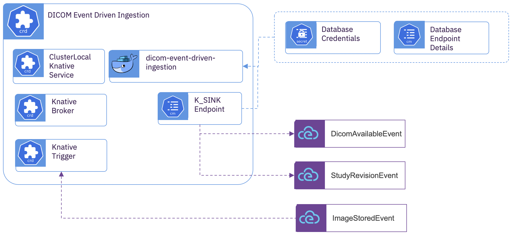

# DICOM Event Driven Ingestion 

## Overview
  The *DICOM Event Driven Ingestion* maintains a manifest of all of the ingested DICOM data across all storage spaces.  Whenever DICOM instances are ingested by any of the ingestion services, the *DICOM Event Driven Ingestion* subcomponent captures the metadata associated with each DICOM instance within a relational model.  Once the metadata is captured, the instances are available for distribution to all of the *DICOM Instance Bindings* for processing.  The ingestion sub-component organizes the DICOM instances into series and studies and forms an opinion when a study has been completely ingested.  Once that determination has been made, distribution to the *DICOM Study Bindings* notify of the existence of a study.  In a number of use-cases, a study may be updated after the initial determination and *DICOM Study Bindings* are notified of the update through a new revision of the study.

## Subcomponent Architecture



The *DICOM Event Driven Ingestion* subcomponent is comprised of a single container.  The container manages a manifest of all information provided by the *ImageStoredEvent* into the provided system of record.  The container has two services:
  - An event processor service which will be invoked by the trigger within the broker whenever an *ImagedStoredEvent* occurs.
  - A /query service for retrieving the manifest information regarding a study/series/instance


## Deployment 
  To prepare for deployment, a database must be created for the imaging manifest data.  Configuration and security details for the database are configured through a *ConfigMap* and a *Secret*.  
  
**Database Configuration Details**

Create a *ConfigMap* with the database connection details.

```yaml
kind: ConfigMap
apiVersion: v1
metadata:
  name: db-config
data:
  DATASOURCE_MAX_SIZE: '50'
  DB_HOST: img-ingest-db
  # Default DB_KIND is 'postgresql'.  To use DB2, declare 'db2' as the DB_KIND.
  #DB_KIND: db2
  DB_NAME: img-manifest
  DB_PORT: '5432'
  EVENT_LOOPS_POOL_SIZE: '20'
  HTTP_IO_THREADS: '20'
```
  
**Database Credentials**

Create a *Opague Secret* with the database user and password

```yaml
kind: Secret
apiVersion: v1
metadata:
  name: db-secret
data:
  DB_PASS: aaaaaaa=
  DB_USER: bbbbbb=
type: Opaque
```


**Custom Resource**

Create the subcomponent deployment

```yaml
apiVersion: imaging-ingestion.alvearie.org/v1alpha1
kind: DicomEventDrivenIngestion
metadata:
  #  This will be the name of the broker used for eventing.  
  # All other subcomponents will need to reference this.
  name: core
spec:
  # Default container uses PostgreSQL.  To use DB2 override the default image
  #image: alvearie/dicom-event-driven-ingestion-db2:0.0.1
  # Reference to the database configuration
  databaseConfigName: db-config
  # Reference to the dataabase credential
  databaseSecretName: db-secret
  # Scaling behavior of the service
  eventProcessor:
    concurrency: 0
    maxReplicas: 3
    minReplicas: 0
```

## Using alternative SQL databases
  The Event Driven Ingestion Service uses a relational database to maintain the imaging data manifest.  Implemented in Quarkus, it is possible to support a number of different database providers by modifying a few properties in [application.properties](../../dicom-event-driven-ingestion/src/main/resources/application.properties).  Refer to the [Quarkus Datasources](https://quarkus.io/guides/datasource) documentation for details.  
  
As part of building a native image, the JDBC driver is included in a single binary within the container image.  With the current build, in order to use use an alternative database provider, a separate container needs to be built for each provider.  The provided *Kubernetes* operator allows alternative containers to be configured with the *DicomEventDrivenIngestion* custom resource.  

The current build action creates two different containers; one for PostgreSQL, and one for IBM DB2.  
  

